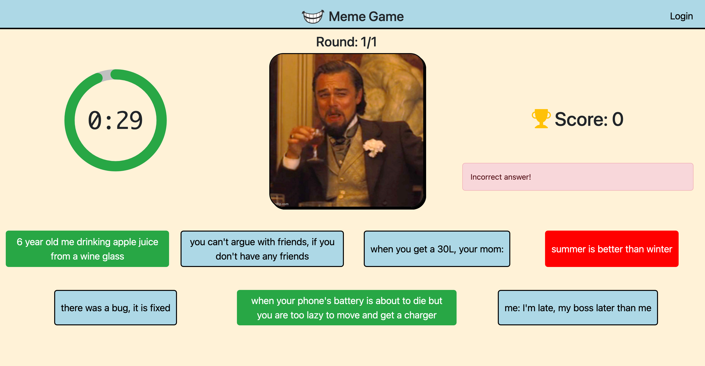

[](https://classroom.github.com/a/AVMm0VzU)
# Exam #1: "Meme Game"
## Student: s323642 CORICCIATI EMANUELE 

## React Client Application Routes

- Route `/`: landing page for all users
- Route `/game`: page where the game is played
- Route `/login`: page where users log in
- Route `/profile`: page displaying user data, including the history of games
- Route `/games/:id`: page displaying the statistics of a specific game (identified by its id) for a user
- Route `*`: page not found


## Main React Components

- `CtaButton` (in `CtaButton.jsx`): button used throughout the app to perform actions when pressed
- `LoginPage` (in `LoginPage.jsx`): it displays a form for logging in an user and provides a feedback if there are errors during login
- `ProfilePage` (in `ProfilePage.jsx`): it displays the statistics for an user with the history of all games
- `Game` (in `Game.jsx`): it displays some info about the game
- `GameSummaryPage` (in `GameSummaryPage.jsx`): it displays all statistics for a game, including rounds and correct/wrong captions
- `GamePage` (in `GamePage.jsx`): it displays a meme with 7 captions, handles API calls to validate answers, fetch memes and captions, and manages time
- `Caption` (in `Caption.jsx`): it displays a caption of a meme; changes its color based on the user's answer after validation
- `Timer` (in `Timer.jsx`): it displays a countdown timer from 30s to 0. The value is computed using a ref on the current time. The counter state enables animation. When stopped by the game page, it returns the current value of the counter
- `GameOver` (in `GameOver.jsx`): modal that appears on the game page when the game ends. It displays a summary of the game for logged-in users; otherwise, it shows only the total points and time taken
- `LoadingSpinner` (in `LoadingSpinner.jsx`): loading spinner displayed when data is not ready, used in `App.jsx` and `GamePage.jsx`


## API Server

- POST `/api/sessions`: authenticate the user who is trying to login
  - request body content:
    ```JSON
    {
        "username": "emanuele.coricciati@studenti.polito.it",
        "password": "password"
    }
    ```

  - response body content: authenticated user
    ```JSON
    {
      "id": 2,
      "username": "emanuele.coricciati@studenti.polito.it", 
      "name": "Emanuele"
    }
    ```

  - response status codes and possible errors:
  `200 OK` (success)
  `500 Internal Server Error` (generic error)
  `401 Unauthorized User` (invalid login)
- GET `/api/sessions/current`: Check if user is logged in
  - request parameters: _None_
  - response body content: authenticated user
    ```JSON
    {
      "id": 2,
      "username": "emanuele.coricciati@studenti.polito.it", 
      "name": "Emanuele"
    }
    ```
  - response status codes and possible errors:
  `200 OK` (success)
  `500 Internal Server Error` (generic error)
  `401 Unauthorized User` (user is not logged in)
- DELETE `/api/sessions/current`: logout current user
  - request parameters and request body content: _None_
  - response body content: _None_
  - response status codes and possible errors:
  `200 OK` (success)
  `500 Internal Server Error` (generic error)
  `401 Unauthorized User` (user is not logged in)
- GET `/api/memes/random`: Get a random meme while excluding those specified in the `ids` parameter
  - query parameters: `ids`:
  `/api/memes/random?ids:1,2,3`
  - response body content: 
  ```JSON
  {
    "id": 18,
    "filename": "18.jpg",
    "captions": [
      {
        "id": 48,
        "text": "it's your birthday and everyone's singing to you"
      },
      {
        "id": 19,
        "text": "students waiting for the weekends"
      },
      {
        "id": 52,
        "text": "one does not simply, reply \"no\" when grandma asks you if  you're hungry"
      },
      {
        "id": 32,
        "text": "my parents explaining to me how the internet works, \"hackers, hackers everywhere\""
      },
      {
        "id": 37,
        "text": "when my parents tell me to eat my vegetables, me:"
      },
      {
        "id": 58,
        "text": "you when you say something your parents didn't know"
      },
      {
        "id": 53,
        "text": "one does not simply, watch one episode on Netflix"
      }
    ]
  }
  ```
  - response status codes and possible errors:
  `200 OK` (success)
  `500 Internal Server Error` (generic error)
- GET `/api/memes/:id/validate/:captionId`: Validate the meme caption answer, it returns the correct captions
  - request parameters: meme `id`,`captionId`
  - response body content: 
  ```JSON
  {
    "isCorrect": true,
    "correctCaptions": [
      {
        "id": 1,
        "text": "6 year old me drinking apple juice from a wine glass"
      },
      {
        "id": 2,
        "text": "when your phone's battery is about to die but you are too lazy to move and get a charger"
      }
    ]
  }
  ```
  - response status codes and possible errors:
  `200 OK` (success)
  `500 Internal Server Error` (generic error)
- POST `/api/games`: Save a game result
  - request body content:    
  ```JSON
  {
    "total": 10,
    "date": "2024-06-26T10:05:55.907Z",
    "time_taken": 9,
    "rounds": [
      {
        "round_number": 1,
        "imageId": 4,
        "captionId": 10,
        "points": 5,
        "caption": "when I get an advertisement for an adblocker"
      },
      {
        "round_number": 2,
        "imageId": 15,
        "captionId": 35,
        "points": 0,
        "caption": "me, that rock in my shoe"
      },
      {
        "round_number": 3,
        "imageId": 20,
        "captionId": 59,
        "points": 5,
        "caption": "go ahead, I'm listening"
      }
    ]
  }
  ```
  - response body content: _None_
  - response status codes and possible errors:
  `200 OK` (success)
  `401 Unauthorized` (User is not logged in)
  `500 Internal Server Error` (generic error)
- GET `/api/games`: Get all past games for an user
  - request body content: _None_
  - response body content:
  ```JSON
    [
      {
        "game_id": 1,
        "user_id": 1,
        "total": 15,
        "date": "1719474833444.0",
        "time_taken": 10
      },
      {
        "game_id": 2,
        "user_id": 1,
        "total": 15,
        "date": "1719445806432.0",
        "time_taken": 10
      },
   ]
  ```
  - response status codes and possible errors:
  `200 OK` (success)
  `401 Unauthorized` (User is not logged in)
  `500 Internal Server Error` (generic error)
- GET `/api/games/:id`: Get all past games for an user
  - request parameters: game `id` 
  - response body content:
  ```JSON
  {
    "game_id": 1,
    "total": 15,
    "date": "1719474833444.0",
    "time_taken": 10,
    "rounds": [
      {
        "round_number": 1,
        "image": "8.jpg",
        "caption": "summer is better than winter",
        "points": 5
      },
      {
        "round_number": 2,
        "image": "6.jpg",
        "caption": "do work, play games",
        "points": 5
      },
      {
        "round_number": 3,
        "image": "7.jpg",
        "caption": "students waiting for the weekends",
        "points": 5
      }
    ]
  }
  ```
  - response status codes and possible errors:
  `200 OK` (success)
  `401 Unauthorized` (User is not logged in)
  `404 Not found` (Game not found)
  `500 Internal Server Error` (generic error)
- GET `/api/games/total`: Get total points for an user
  - response body content:
  ```JSON
  10
  ```
  - response status codes and possible errors:
  `200 OK` (success)
  `401 Unauthorized` (User is not logged in)
  `404 Not Found` (Pointes not available)
  `500 Internal Server Error` (generic error)
- GET `/api/user/memes/unlocked`: Get unlocked memes for an user
  - response body content:
  ```JSON
  {
    "unlockedMemes": 17,
    "totalMemes": 20
  }
  ```
  - response status codes and possible errors:
  `200 OK` (success)
  `401 Unauthorized` (User is not logged in)
  `404 Not Found` (Unlocked memes not available)
  `500 Internal Server Error` (generic error)
## Database Tables

- Table `users` -  Stores registered users eligible to play the game
- Table `images` - Stores meme images, with fields including meme `id` and `filename`.
- Table `captions` - Stores captions associated with memes, with fields including caption `id` and text of the `caption`
- Table `image_captions` - Associates memes (`imageId`) with their captions (`captionId`)
- Table `games` - Records all games played by users, with fields including `game_id`, `user_id`, `total` (total points), `date`, and `time_taken`.
- Table `rounds` - Tracks rounds within games for users, with fields including `game_id`, `round_number`, `image_id` (meme played), `caption_id`(selected caption), and `points`
- Table `sqlite_sequence` - Automatically generated table that tracks incremental IDs for `userId`, `imageId`, and `gameId`


## Screenshots





## Users Credentials

|         email         | plain-text password      |
|-----------------------|--------------------------|
| john.doe@studenti.polito.it   |password          |
| emanuele.coricciati@studenti.polito.it| password |
| testuser@gmail.com    |password                  |